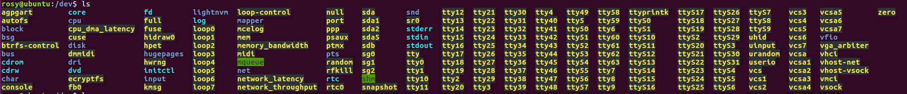

# LABORATOIRE 1 - LINUX BACKUP

## TASK 1: PREPARE THE BACKUP DISK

1. Before plugging the disk in examine the special files in the /dev directory that represent hard disks. List all files called

 - /dev/hd*
 - /dev/sd*

 Which disks and which partitions on these disks are visible?

 **Answer :**
 

 No disk beginning by hd is visible. Same thing for the partitions.
 When it comes to disks and partitions beginning by sd, we get the following :
 - The sda disk is visible with its respective partitions :
 	- sda1
 	- sda2
 	- sda5
 - The sdb disk is visible with no partitions

 Which partitions are mounted? Use the command mount without parameters to find out.

 **Answer :**
  Here is the result of the mount command without parameters :

 
  
  Here is the result of the mount command without parameters when we look for an sda partition :

 
  
  We can conclude that the only partition that is mounted is the sda1 partition.

2. Attach the disk to your computer. Consult the special files in /dev. Which new files appeared? These represent the disk and partitions you just attached

 **Answer :**

 

According to the result of the ls command, we notice that that the disk sdc and its partitions sdc1 and sdc2 have appeared another special file named sg3 has also appeared.

3. Create a partition table on the disk and create two partitions of equal size using the parted tool

 

 
 
 

4. Format the two partitions using the mkfs command.

 

5. Create two empty directories in the /mnt directory as mount points, called backup1 and backup2. Mount the newly created file systems in these directories.
 
 

6. How much free space is available on these filesystems? Use the df command to find out. What does the -h option do?

 **Answer :**

 

30GB are available on each of these filesystems `-h` stands for human-readable: it prints sizes in power of 1024 (e.g., 1023M).
  

## TASK 2: PERFORM BACKUPS USING TAR AND ZIP

In this task you will perform different backup tasks. For each write a quick reference that you would consult as a system administrator when you have forgotten the exact invocation of the command. Do this using the tar command and then using the zip command.

**TAR COMMAND**

The backup tasks are the following:

+ Do a backup of a user's home directory to the backup disk (VFAT partition). Create a compressed archive. Do the files in the archive have a relative path so that you can restore them later to any place?

 Yes, the files in the archive have a relative path so that you can restore them later to any place.

+ List the content of the archive.

+ Do a restore of the archive to a different place, say /tmp.

+ Do an incremental backup that saves only files that were modified after, say, September 23, 2016, 10:42:33. Do this only for tar, not for zip.

  - Use the find command to determine the files that should be included in the backup.

  find /home/rosy -type f -newermt '9/23/2016 10:42:33'
  

**Je laisse cette partie pour plus tard pour pas perdre mon temps**

**ZIP COMMAND**

+ Do a backup of a user's home directory to the backup disk (VFAT partition). Create a compressed archive. Do the files in the archive have a relative path so that you can restore them later to any place?

+ List the content of the archive.

+ Do a restore of the archive to a different place, say /tmp.

## TASK 3: BACKUP OF FILE METADATA

In this task you will examine how well the backup commands preserve file metadata. Consult the man pages and perform tests using tar and zip and examine whether you can restore:

**TAR COMMAND**

+ the last modification time :
	Yes, by using the flag : `--delay-directory-restore`

	

+ the permissions :
	Yes, by using the flag : `-p` or `--preserve-permissions` or `--same-permissions`

	

+ the owner :
	Yes, by using the flag : `--same-owner`

	

**ZIP COMMAND**

+ the last modification time :
+ the permissions :
	The answer is no except under unix for both:

	

+ the owner :

	Yes, by using the flag : `-X` (It works only for UNIX, VMS, OS/2, NT)
	

## TASK 4: SYMBOLIC AND HARD LINKS

In this task you will examine whether the backup commands preserve symbolic and hard links. Consult the man pages and perform tests using tar and zip. In the lab report describe the tests you did and their results.

**TAR COMMAND**

+ symbolic links: Yes, we can preserve them by using the flag : `-h` or `--dereference`

+ hard links: Yes, we can preserve them by using the flag : `--hard-dereference`

**ZIP COMMAND**

+ symbolic links: Yes, we can preserve them by using the flag : `-y` or `--symlinks`

+ hard links: Nothing seems to be preserving hard links with the zip command
